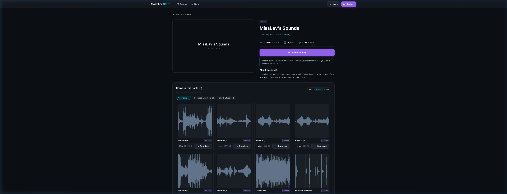

# CC0-Public-Domain-Sounds

A massive, curated collection of **100% CC0 Public Domain Sound Effects, Foley, Ambience, and Music** for game developers, sound designers, and filmmakers.

Every sound in this repository comes with rendered high-resolution waveform preview thumbnails, verified provenance, and clean metadata tags.

[](https://store.modelibr.com)

---

## Live Catalog & One-Click Import

All sound packs in this repository are indexed and hosted on **[store.modelibr.com](https://store.modelibr.com)**:

- **Interactive Audio & Waveform Browsing**: Stream, play, and inspect waveforms directly in your browser.
- **One-Click Local Import**: Import packs and individual sound clips directly into your local **[Modelibr](https://github.com/Papyszoo/Modelibr)** desktop instance.
- **Standardized Sound Taxonomy**: Thousands of audio samples categorized across 12 standardized sound domains:
  - `Ambience`, `Music`, `UI & Interface`, `Footsteps`, `Impacts & Hits`, `Weapons & Combat`
  - `Voice & Vocals`, `Creatures & Animals`, `Machines & Vehicles`, `Magic & Spells`, `Foley & Objects`, `Whooshes & Transitions`

---

## Included Collections

| Creator / Collection | Packs | Description |
| :--- | :--- | :--- |
| **[Kenney](https://kenney.nl)** | 9 Packs | Comprehensive low-poly sound libraries (UI Audio, Interface, Impact, Digital, Casino, RPG, Music Jingles, Voiceover Fighter). |
| **[BrainBytes / Sonniss GDC](https://sonniss.com)** | 14 Packs | High-fidelity field recordings (Fans & Drones, Japanese Pull Saw, Keyboards, Novice Cello, Pill Bottles, Rubik's Cube, Mechanisms, Books & Paper). |
| **[2HTC / Sonniss GDC](https://sonniss.com)** | 3 MegaPacks | Hundreds of foley, texture, movement, and studio recordings from the 2HTC series. |
| **[Warfork](https://warfork.com)** | 1 MegaPack | 349 arena FPS combat sounds, weapons, movement, announcements, and electronic music. |
| **[Community Sound Packs](https://freesound.org)** | 25+ Packs | Micro packs, retro arcade sounds, creatures, magic, synthesized retro SFX, and atmospheric soundscapes. |

---

## Repository Layout

Every sound pack is completely self-contained in its own directory:

```text
packs/
  <pack-slug>/
    pack.json              # Authored metadata (name, creator, website, license, description)
    cover.png              # Pack cover art / catalog listing thumbnail
    store-manifest.json    # Self-contained store manifest pinned to Git commit
    sounds/                # Audio files (.wav, .mp3, .ogg, .flac) + original licenses
    thumbnails/            # Rendered waveform preview PNGs mirroring sounds/ paths
scripts/
  gen_store_manifest.py    # Generates per-pack store-manifest.json files
  render_waveforms.py      # Generates audio waveform PNGs
  fetch_official_covers.py # Synchronizes verified author artwork
```

---

## License

All audio files in this repository are dedicated to the public domain under the **[Creative Commons Zero 1.0 Universal (CC0 1.0)](https://creativecommons.org/publicdomain/zero/1.0/)** license. You may freely use, modify, distribute, and monetize these audio assets in personal and commercial projects without attribution.
